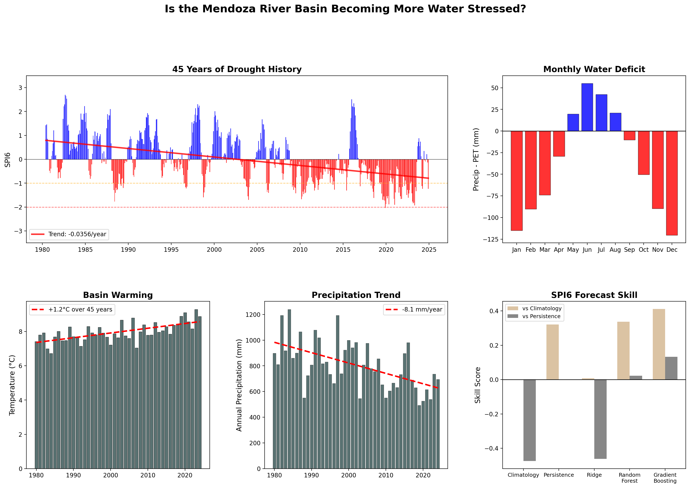

# Is the Mendoza River Basin Becoming More Water-Stressed?



Hydrological analysis of Argentina's Mendoza River Basin using ERA5 reanalysis data. 

The Mendoza River Basin supplies water to over 1 million people and irrigates one of Argentina's most productive agricultural regions. The basin depends on Andean snowmelt and summer rainfall, making it highly sensitive to climate variability. This project investigates whether water stress is increasing and whether drought conditions can be predicted in advance.

## Answer

The Mendoza River Basin shows clear signals of increasing water stress over the 1980–2024 period. Precipitation is *declining* while temperatures are *rising*, expanding the gap between water supply and atmospheric demand. Drought frequency *increased* from **7.3**% of months (1980–2001) to **27.9**% (2002–2024), and the most recent decade containing the most extreme and *longest* drought recorded. Machine learning models confirm that recent climate conditions carry predictive signal for drought 3 months ahead, but also reveal that the basin's shifting climate makes historical patterns an increasingly unreliable guide to the future.

## Data

ERA5 Reanalysis Copernicus   
- Variables: Precipitation, Temperature, PET, Runoff, Soil Moisture 
- Resolution: 0.25° monthly 
- Range: 1980-2024  

## Key Findings

### Basin Climatology

- Mean Annual Precipitation: **806mm**  
- Mean Annual Potential Evapotranspiration: **1247mm**  
- Annual Water Deficit (P - PET): **-441mm**    
- Wettest Month: **June**   
- Driest Month:  **April**  

### Long Term Trends

- Precipitation Trend: **-8.07mm/year**  
- Temperature Trend: **0.03°C/year**, Total Change: **1.24°C**  
- Runoff Trend: **-6.84mm/year**    
- Annual Water Deficit: **-12.80mm/year**   

### Drought Analysis

- Drought Events: **27 drought events**  
- Longest Drought: **2019-07** to **2020-05** (11 months)        
- Most Severe Drought: **2019-07** to **2020-05** (Peak SPI6: -2.04)    
- Drought Frequency: **increased** from **7.3%** (1980-2001) to **27.9%** (2002-2024)   

### Machine Learning Drought Forecasting

**Target**: SPI3 (3 Month Lead)  
**Best Model**: Random Forest  
**Skill vs Climatology**: 16.7%  
**Skill vs Persistence**: 24.5%  

**Target**: SPI6 (3 Month Lead)  
**Best Model**: Gradient Boosting  
**Skill vs Climatology**: 41.1%  
**Skill vs Persistence**: 13.2%  

- **Short term drought (SPI3)** is predictable 3 months ahead, Random Forest reduces the error by 24% compared to naive persistence 
- **Medium term drought (SPI6)** is harder because consecutive values share 50% of their precipitation window, making persistence a strong baseline. Gradient Boosting still achieves 10% improvement, indicating genuine predictive signal about drought evolution 
- **Feature importance** reveals that the most recent SPI3 value alone accounts for ~43% of the model's predictive power, making sense as current short term drought state is the strongest indicator of medium term drought ahead  
- **All models show negative R²** due to non stationarity: the test period (2017–2024) is systematically drier than the training period (1980–2016). This is not model failure but rather more proof of the basin's shifting climate, and means operational models would need periodic retraining

### Anomaly Detection

 Isolation Forest identified **27 anomalous months** (5% of record) based on unusual multivariate climate conditions. Anomalies are primarily **extreme wet events**: precipitation +75% above normal, runoff +197%, saturated soils. This complements the drought analysis well as SPI captures dry extremes while Isolation Forest captures wet extremes. Both drought and extreme rainfall represent water risk for agricultural systems that depend on predictable supply.

 ## Notebooks

1: Data Collection - ERA5 download via CDS API, unit conversion, quality checks  
2: Exploratory Analysis - Seasonal climatology, long term trends, variable correlations   
3: Drought Indices - SPI/SPEI computation, drought event catalog, frequency analysis   
4: ML Forecasting - Supervised drought prediction with baseline comparison   
5: Anomaly Detection - Unsupervised identification of unusual climate conditions   

## Setup
```bash
mamba env create -f environment.yml
conda activate basin-analysis

